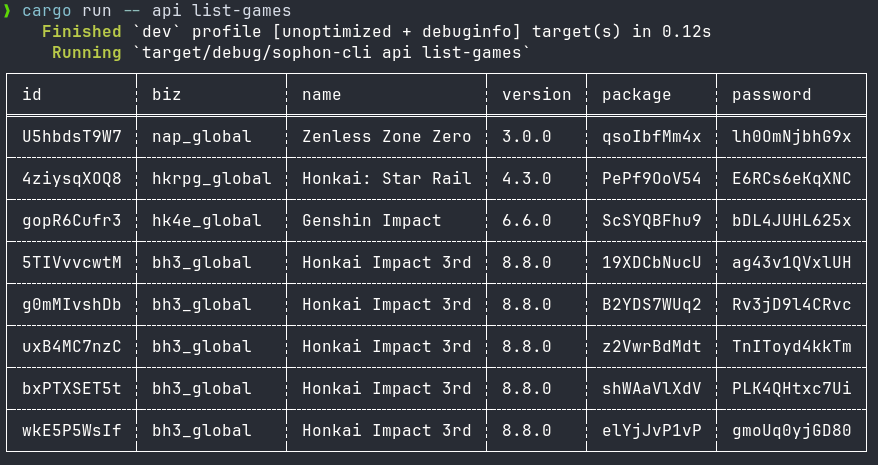
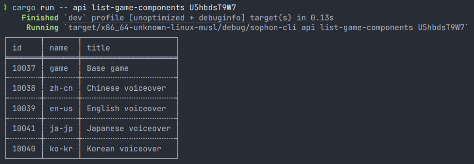
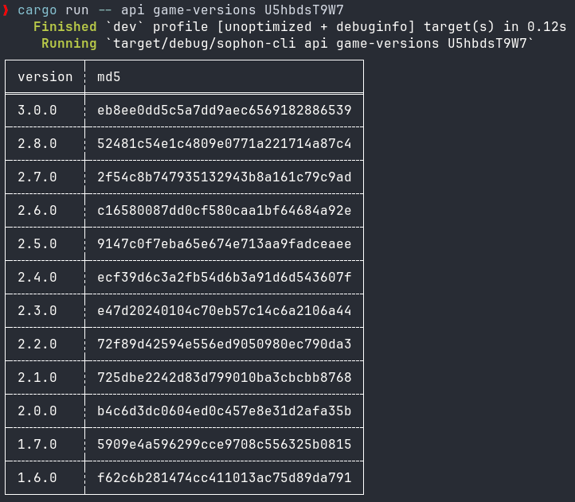
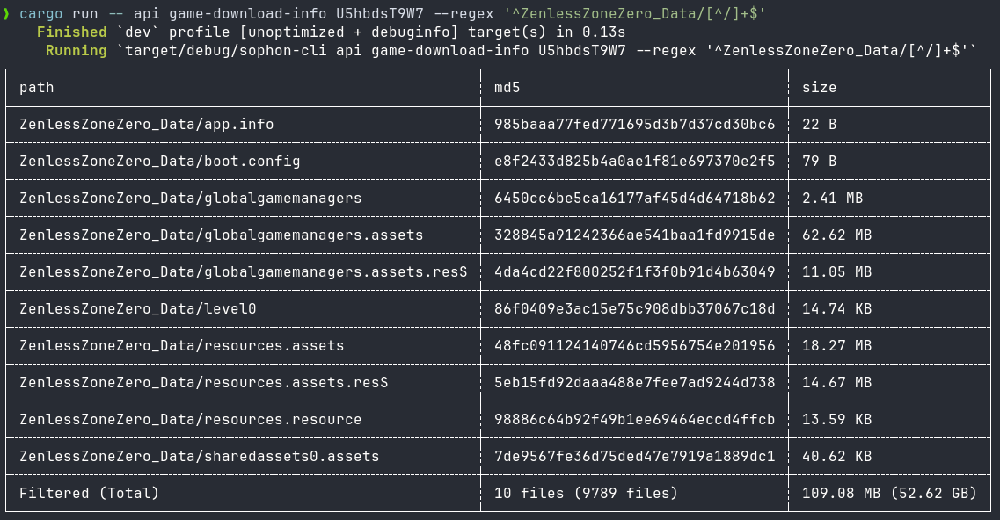

# sophon-tools

High-performance async sophon downloader implementation written in Rust.

<table>
    <tr>
        <td></td>
        <td></td>
    </tr>
    <tr>
        <td></td>
        <td></td>
    </tr>
</table>

## Features

- Async-native
- Pure rust and musl-friendly, no C bindings used
- Simple API interactions
- Files verification for any game version and component, with different modes
- Smart files downloading for any game version and component with no disk
  cache writes and proxy support
- Feature-rich files updater with pre-downloading support
- Nice CLI with JSON output format support for embedding usage

## Philosophy

Instead of making a complex solution to solve every problem, the library
provides three main classes: `SophonDownloader`, `SophonUpdater` and
`SophonVerifier` (which is used in both internally). The work with game
installations thus is split into three main commands: `download`, `update` and
`verify`.

- Downloader fetches information about the files at specific version and
  downloads them to the given directory. If configured to, downloader will
  skip already downloaded files which are valid. Besides downloading the game,
  it can be used to repair already existing installation too.

- Updater will find all the files that are possible to update from one version
  to another. It will download patches to the given directory, or use already
  downloaded patches if configured to. Then, if user wants to, updater can apply
  these patches to the game files, and delete used patches from the directory.
  Updater can be used to delete files that are not used in the given version,
  to (pre-)download updates, and to patch game files.

- Verifier simply checks files it's pointed to and compares them against known
  expected information.

Some files cannot be updated between different versions, some updates may fail,
some files may become missing. You can mix these tools together to maintain your
game installation at the state you want it to be.

## NixOS support

To use the sophon-tools CLI you can run the following command:

```bash
nix run git+https://dawn.wine/dawn-winery/sophon-tools -- --help
```

To add it to your system:

```nix
{
    inputs = {
        sophon-tools.url = "git+https://dawn.wine/dawn-winery/sophon-tools";
    };

    outputs = { sophon-tools, ... }: {
        nixosConfigurations.default = nixpkgs.lib.nixosSystem {
            modules = [
                ({ ... }: {
                    environment.systemPackages = [
                        sophon-tools.packages.${system}.default
                    ];
                })
            ];
        };
    };
}
```

Licensed under [GPL-3.0-or-later](LICENSE)
